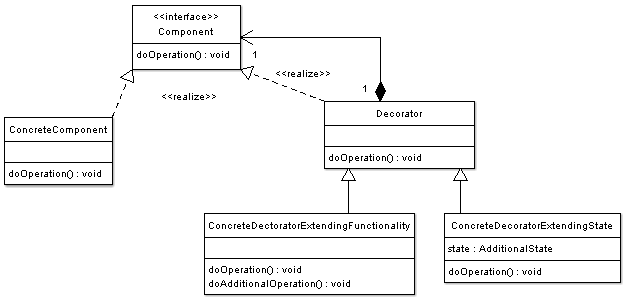

# Decorator Pattern

Consider the typical example of a graphical window. To extend the functionality of the graphical window for example by adding a frame to the window, would require extending the window class to create a FramedWindow class. 
To create a framed window it is necessary to create an object of the FramedWindow class. However it would be impossible to start with a plain window and to extend its functionality at runtime to become a framed window.

## Why? 
The intent of this pattern is to add additional responsibilities dynamically to an object.
The decorator dynamically composes objects, adding new code rather than altering existing.
The object will be decorated with responsibilities/attributes which you summate for your purposes.
 
## How? 
In the basic example, the object is decorated (wrapped) by another; dark roast is decorated by mocha. This is possible because they are the same type, Beverage; 
The objects will have the same methods, and through polymorphism we can treat all the decorators as Beverage. 
The example uses the cost method which is called on the outermost decorator, and this delegates the calculation to the next innermost object, and so on. 
Once a cost is returned, this is passed back out through wrappers. 

The concrete component inherits from component (abstract or interface). The decorator abstract class then implements the component interface also. 
The options (behavioural extensions) extend the decorator interface, after which they can be used to wrap the base class and all subsequent decorators. 

* Decorators have the same supertype as the objects they decorate. 
* One or more decorators wrap an object. 
* Given the decorator has the same type as the object it decorates, we pass around the decorator in place of the wrapped object. 
* __The decorator adds its own behaviour either before or after delegating to the object it decorates to do the rest of the job.__

## Open Closed Principle
Classes should be open for extension, closed for modification. 
Our goal is to extend behaviour without altering existing code. 
This can't be applied to absolutely everything, as this sort of effort would be quite wasteful. 
Just do it for the areas you anticipate to change often. 

The Decorator pattern provides a more flexible way to add responsibilities to objects than can be had with static (multiple) inheritance. 
With decorators, responsibilities can be added and removed at run-time simply by attaching and detaching them. 
In contrast, inheritance requires creating a new class for each additional responsibility (e.g., BorderedScrollableTextView, BorderedTextView). 
This gives rise to many classes and increases the complexity of a system. 
Furthermore, providing different Decorator classes for a specific Component class lets you mix and match responsibilities.

Decorator is a design pattern for dynamically enhancing objects without modifying the original behavior by wrapping, enhancing, and calling the wrappee.

