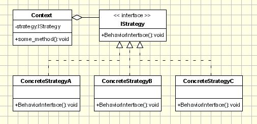

# Strategy Pattern

Super class Animal uses interface in a non-typical way. 
It uses an instance variable that is a subclass of the Flys interface.

Animal does not care what flyingType does, it just knows the behavior is available to its subclasses. 

### Design Principle: Favour composition over inheritance 

Instead of inheriting an ability through inheritance the class is composed with objects with the right ability. 
Composition allows you to change the capabilities of objects at run time. 

Animal's setFlyAbility method takes a behaviour of interface type Flys, and can then set the behaviour at run time. 

The animal super class never implements behaviour directly, as these change between the subclasses. 
If behaviour is implemented, maintenance and duplication increases.  

### Design Principle: Identify the aspects of your application vary and separate them from what is the same. 

Take the parts that vary and encapsulate them, so that later you can alter or extend the parts without affecting those that don't. 

The Flys interface is responsible for this. 
The interface is implemented by many other subclasses that allow for many types of flying without effecting Animal, or Flys.
Classes that implement new Flys interface subclasses can allow other classes to use that code eliminating code duplication
Here we decouple - the parts that change are then abstracted. 